# Algorithms

## Table of contents

- [Algorithms](#algorithms)
  - [Table of contents](#table-of-contents)
  - [Dynamic connectivity](#dynamic-connectivity)
    - [Quick Find - An eager approach](#quick-find---an-eager-approach)
    - [Quick Union - A lazy approach](#quick-union---a-lazy-approach)
    - [Improving quick find and quick union](#improving-quick-find-and-quick-union)
    - [Percolation](#percolation)
  - [Stack](#stack)
  - [Queue](#queue)
  - [Sorting](#sorting)
    - [Merge Sort](#merge-sort)
      - [Merge sort with insertion sort](#merge-sort-with-insertion-sort)
      - [Merge sort with partially-ordered arrays](#merge-sort-with-partially-ordered-arrays)
      - [Bottom-up merge sort](#bottom-up-merge-sort)
    - [Quick Sort](#quick-sort)
      - [Quick sort with insertion sort](#quick-sort-with-insertion-sort)
      - [Estimating the partition](#estimating-the-partition)
    - [Heap Sort](#heap-sort)
    - [Sorting in Practice](#sorting-in-practice)
  - [Priority Queues](#priority-queues)
    - [Binary Heaps](#binary-heaps)
    - [Heap Sort](#heap-sort-1)
  - [References](#references)

## Dynamic connectivity

Given a set of N objects. A union-find class includes:

-   `UF(int N)`: The constructor of the UF class that initialises a union-find data structure with `N` objects.
-   `void union(a, b)`: A union command connects two objects.
-   `boolean find/connect(a, b)`: Are a and b in the same component?

### Quick Find - An eager approach

<p align="center">
    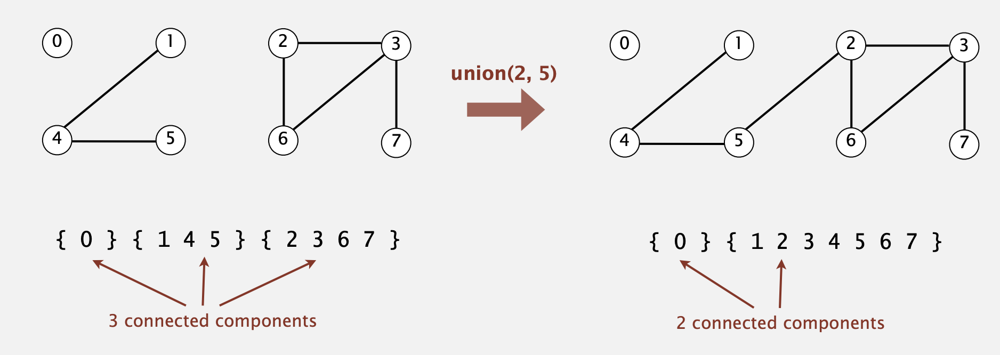
</p>

In quick union, we need an array to keep nodes' locations. For each node `i`, the array `id[i]` keeps where the node `i`
points to. When node p unions to q, we must loop the array and replace all the values that equal to `id[p]` with `id[q]`
.

Example 1

```
[0, 1, 2, 3, 4, 5, 6, 7, 8, 9] -> union(4, 3)
[0, 1, 2, 3, 3, 5, 6, 7, 8, 9] -> union(3, 8)
[0, 1, 2, 8, 8, 5, 6, 7, 8, 9] -> union(6, 5)
[0, 1, 2, 8, 8, 5, 5, 7, 8, 9] -> union(9, 4)
[0, 1, 2, 8, 8, 5, 5, 7, 8, 8] -> union(2, 1)
[0, 1, 1, 8, 8, 5, 5, 7, 8, 8] -> union(5, 0)
[0, 1, 1, 8, 8, 0, 0, 7, 8, 8] -> union(7, 2)
[0, 1, 1, 8, 8, 0, 0, 1, 8, 8] -> union(6, 1)
[1, 1, 1, 8, 8, 1, 1, 1, 8, 8] -> connected(0, 2)
true // array[0] == array[2]
```

### Quick Union - A lazy approach

<p align="center">
    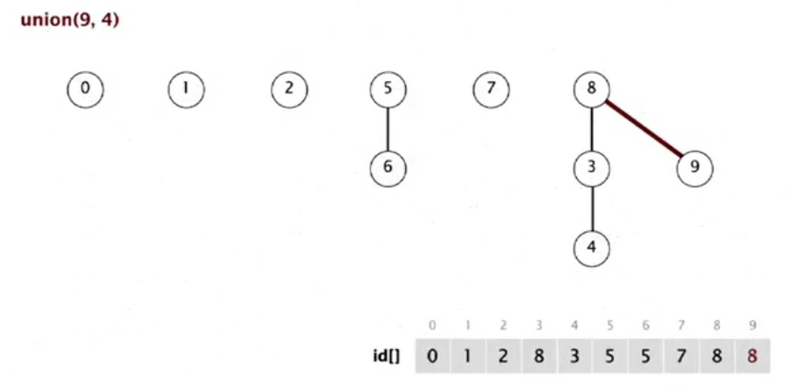
    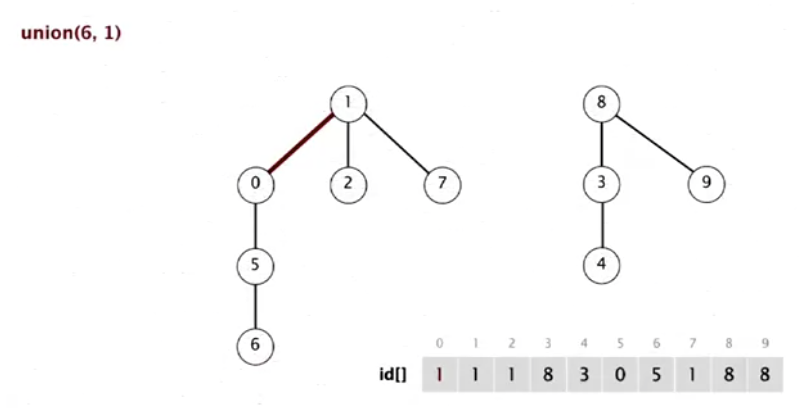
</p>

Quick-find is too slow for huge problems. An alternative is called quick union. In quick union, we need an array to keep
nodes' locations. For each node `i`, the array `id[i]` keeps where the node `i` points to. E.g., `id[0] = 0` means the
node `0` has no parents. `id[3] = 9` means the node `3` is pointing to the node `9`. When node p points to node q, the
root of p points to the root of q. E.g.,

```
   i    0  1  2  3  4  5  6  7  8  9
-------------------------------------
id[i]   0  9  6  5  4  2  6  1  0  5
```

The roots of 3 and 7 are both 6.

### Improving quick find and quick union

|  Algorithm  | Initialise | Union | Find  |
| :---------: | :--------: | :---: | :---: |
| Quick Find  |     N      |   N   |   1   |
| Quick Union |     N      |   N   |   N   |
| Weighted QU |     N      | log N | log N |

If the tree becomes flatter, the cost of find in the quick union will be less. Weighted quick union is an improvement of
the quick union. Instead of joining the root of p to the root of q, it compares the size of trees where p and q are and
merge the root with a smaller tree to the other root.

### Percolation

<p align="center">
    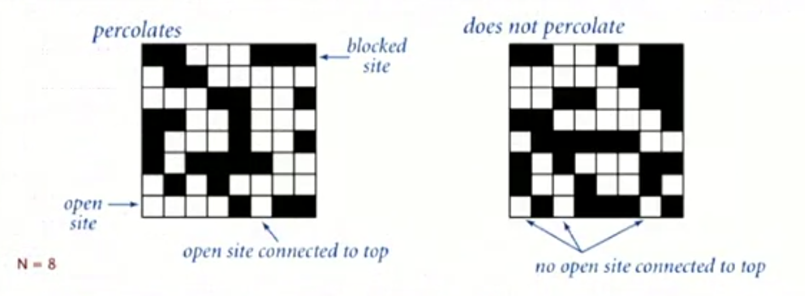
</p>

The Union-Find is a model for many physical systems, specifically, systems percolates iff top and bottom are connected
by open sites.

[programming assignment: percolation]

## Stack

[Stacks]

## Queue

[Queues]

## Sorting

<p align="center">
    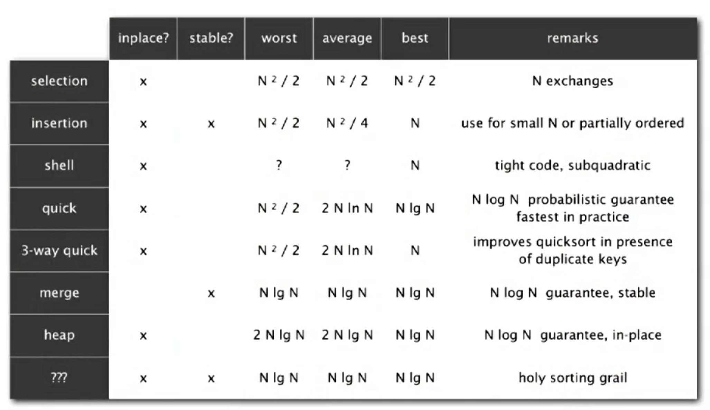
</p>

### Merge Sort

[MergeSort.java]

Merge sort is com used as a primary sorting method in programming languages.

#### Merge sort with insertion sort

Merge sort is too expensive for tiny arrays and has too much overhead for tiny subarrays. An improvement of merge sort is to cut off and use insertion sort to sort for tiny subarrays.

For example, in [MergeSort.java], we have the following code:

```Java
private void sort(Comparable<T> a[], Comparable<T> aux[], int lo, int hi) {
    if (hi <= lo) {
        return;
    }
    int mid = (lo + hi) / 2;
    sort(a, aux, lo, mid);
    sort(a, aux, mid + 1, hi);
    merge(a, aux, lo, mid, hi);
}
```

With insertion sort, it becomes:

```Java
private final static int CUTOFF = 7;
private void sort(Comparable<T> a[], Comparable<T> aux[], int lo, int hi) {
    if (hi <= lo + CUTOFF - 1) {
        InsertionSort.sort(a, lo, hi);
        return;
    }
    int mid = (lo + hi) / 2;
    sort(a, aux, lo, mid);
    sort(a, aux, mid + 1, hi);
    merge(a, aux, lo, mid, hi);
}
```

#### Merge sort with partially-ordered arrays

Another approach to improve merge sort is to stop sorting when subarrays are partially sorted.

```Java
private void sort(Comparable<T> a[], Comparable<T> aux[], int lo, int hi) {
    if (hi <= lo) {
        return;
    }
    int mid = (lo + hi) / 2;
    sort(a, aux, lo, mid);
    sort(a, aux, mid + 1, hi);
    if (a[mid].compareTo((T) a[mid + 1]) <= 0) {
        return;
    }
    merge(a, aux, lo, mid, hi);
}
```

#### Bottom-up merge sort

An implementation of the merge sort without recursion is called the bottom-up merge sort. It works as follows:

```
[4, 2, 6, 8, 1, 5, 3, 9]
 ----
[2, 4, 6, 8, 1, 5, 3, 9]
       ----
[2, 4, 6, 8, 1, 5, 3, 9]
             ----
[2, 4, 6, 8, 1, 5, 3, 9]
                   ----
[2, 4, 6, 8, 1, 5, 3, 9]
 ----------
[2, 4, 6, 8, 1, 5, 3, 9]
             ----------
[2, 4, 6, 8, 1, 3, 5, 9]
 ----------------------
[1, 2, 3, 4, 5, 6, 8, 9]
```

Check out [MergeSortBottomUp.java] to see if it works.

### Quick Sort

[QuickSort.java]

In quick sort, we have a function called `partition`, where we have two pointers, `i` and `j`, and `lo` refers to the lowest element. We start from `i = lo + 1`, ensuring that all elements between `i` and `j` are lesser than `a[lo]`. `j`, on the other hand, is initially equal to`hi` (the highest element). We ensure the subarray ranged from `j` to `hi` is greater than `a[lo]`. We stop the above checking while `j` is less than or equal to `i`. Then we exchange `a[lo]` and `a[j]`.

Below shows how partition works:

```
before
[x|                       ]
[l]                     [j]

during
[x| <=x  |       |   >=x  ]
        [i]     [j]       ]

after
[    <=x    |x|    >=x    ]
[l]         [j]         [h]
```

It is noticeable that we must shuffle the array before actual partition and sorting to have a probabilistic guarantee against the worst case.

#### Quick sort with insertion sort

The way we add insertion sort to quicksort is the same as we do in merge sort. This time, the CUTOFF is 10.

```Java
private final static int CUTOFF = 10;
private void sort(T[] a, int lo, int hi) {
    if (hi <= lo + CUTOFF - 1) {
        InsertionSort.sort(a, lo, hi);
        return;
    }

    int j = partition(a, lo, hi); // j is the correct position, no need to check j again.
    sort(a, lo, j - 1);
    sort(a, j + 1, hi);
}
```

#### Estimating the partition

Another improvement of quicksort is to estimate the partitioning element being near the middle rather than arbitrarily use the first element, which, on average, will be at the middle. The method is to sample the items and take the median of the sample. This improvement is not usually worth the cost of enlarged samples. Three times can slightly reduce the number of comparisons and increase the number of exchanges paradoxically.

```Java
private void sort(T[] a, int lo, int hi) {
    if (hi <= lo) {
        return;
    }

    int m = medianOf3(a, lo, (lo + hi) / 2, hi);
    exch(a, lo, m);
    int j = partition(a, lo, hi); // j is the correct position, no need to check j again.
    sort(a, lo, j - 1);
    sort(a, j + 1, hi);
}
```

### Heap Sort

Check out [Heap Sort](#heap-sort-1).

### Sorting in Practice

1. Given an array of N items, find a kth smallest item.

In this example, we simplify the partition method from quicksort by using one single pointer as follows:

```
before
[                         ]
[l]                     [h]

after
[    <=j    |j|    >=j    ]
[l]         [k]         [h]
```

Check out [Selection.java]

2. Huge numbers of duplicate keys

The solution is to adopt 3-way partitioning. It is a little bit complicated than a standard partitioning method in quicksort.

```
before
[v|                     ]
[l]                    [h]
duration
[ < v | = v |     | > v ]
      [lt]  [i]   [gt]
after
[  < v  |  = v  |  > v  ]
[l]     [lt] [gt]     [h]
```

Check out [DuplicateKeys.java]

## Priority Queues

### Binary Heaps

<p align="center">
    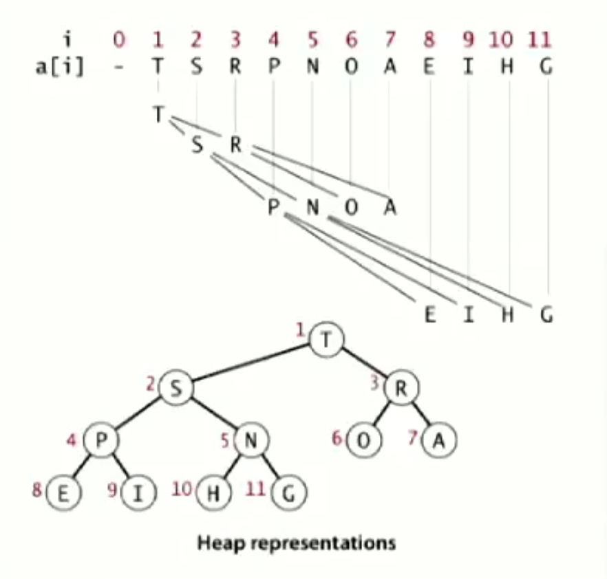
</p>

**Proposition**:

-   Largest key is a[1], which is root of binary tree.
-   Parent of node at k is at k/2.
-   Children of node at k are at 2k and 2k+1.

**Promotion in a heap**:

Scenario: Child's key becomes larger key than its parent's key.

To eliminate the violation, we have to exchange the key in the child with the key in the parent. After that exchange, check if the parent's key is larger than its parent. Finally, we repeat the exchange up to the root.

**Demotion in a heap**:

Scenario: Parent's key becomes smaller than one (or both) of its children's.

To eliminate the violation, we have to exchange the parent's key with the child's key. After that exchange, check if the child's key is smaller than its children. If so, exchange the child's key and its' largest child's. Repeat the exchange until the heap order resorted.

Check out [BinaryHeap.java].

### Heap Sort

Implementation of the binary heap is heap sort. In heap sort, we exchange the root (the max value) with the last node, remove the old root and sink the new root until finding the second largest value. Then we repeat those three steps until all the nodes have checked. Detailed steps are shown below.

|                   | complexity  |
| :---------------: | :---------: |
|  Worst case time  | O(N log(N)) |
|  Best case time   |    O(N)     |
| Average case time | O(N log(N)) |
|       Space       |    O(1)     |

> Although somewhat slower in practice on most machines than a well-implemented quicksort, it has the advantage of a more favorable worst-case O(n log n) runtime. Heapsort is an in-place algorithm, but it is not a stable sort [[1]].

<p align="center">
    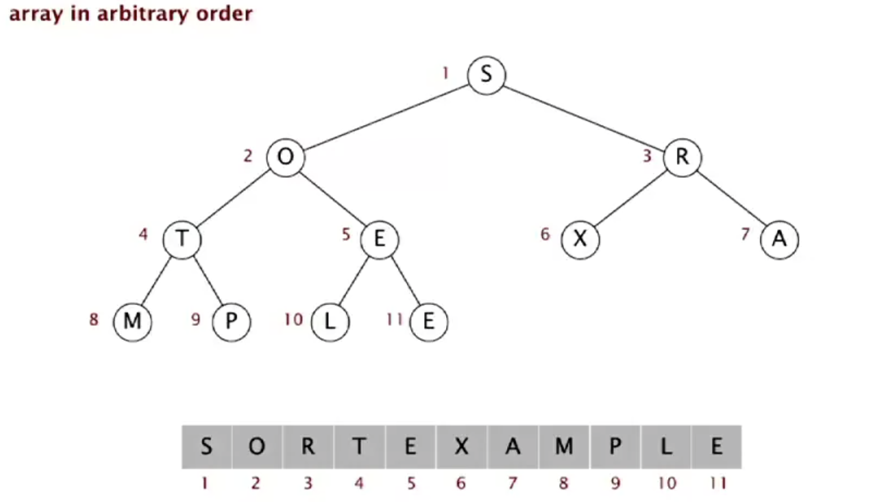
</p>

<p align="center">
    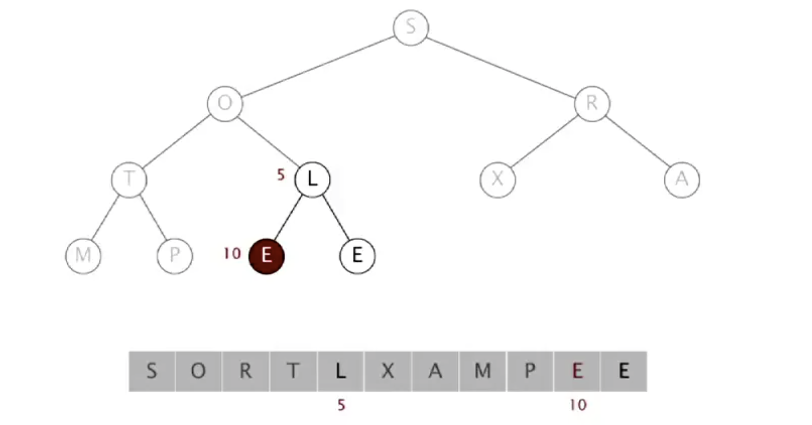
</p>

<p align="center">
    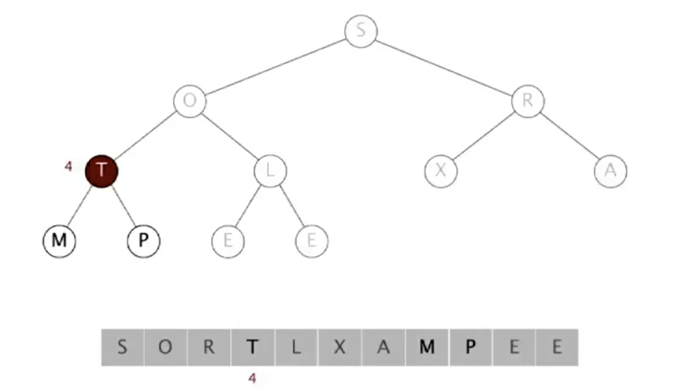
</p>

<p align="center">
    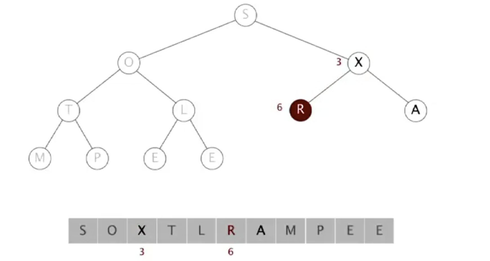
</p>

<p align="center">
    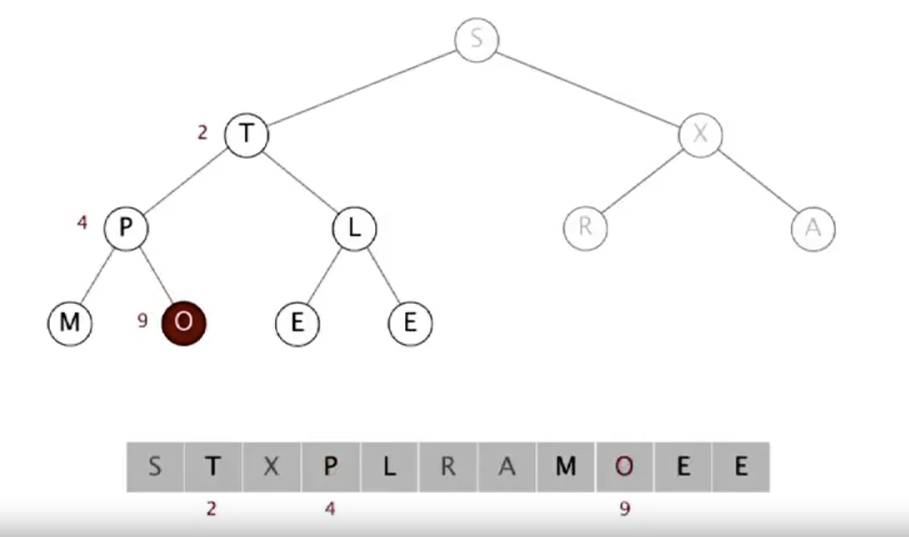
</p>

<p align="center">
    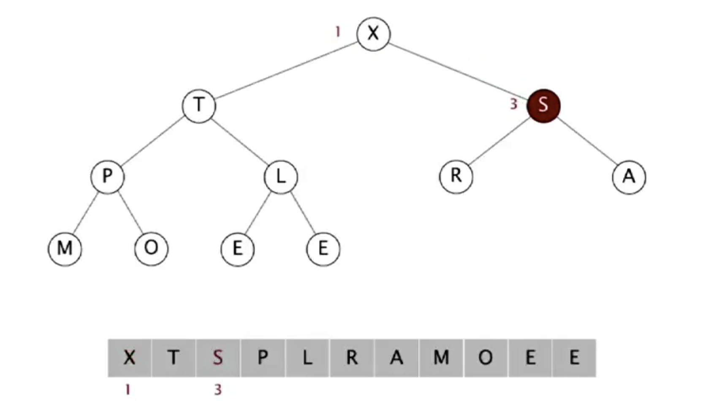
</p>

Exchange the max value with the node at the end. Then we fix the max value.

<p align="center">
    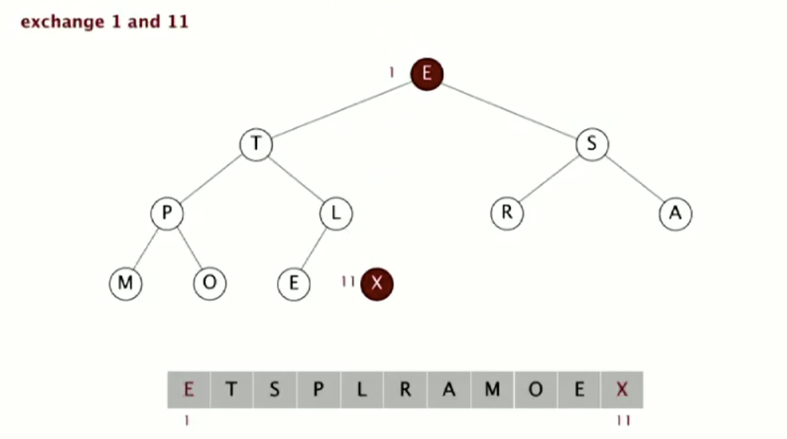
</p>

Sink the new root.

<p align="center">
    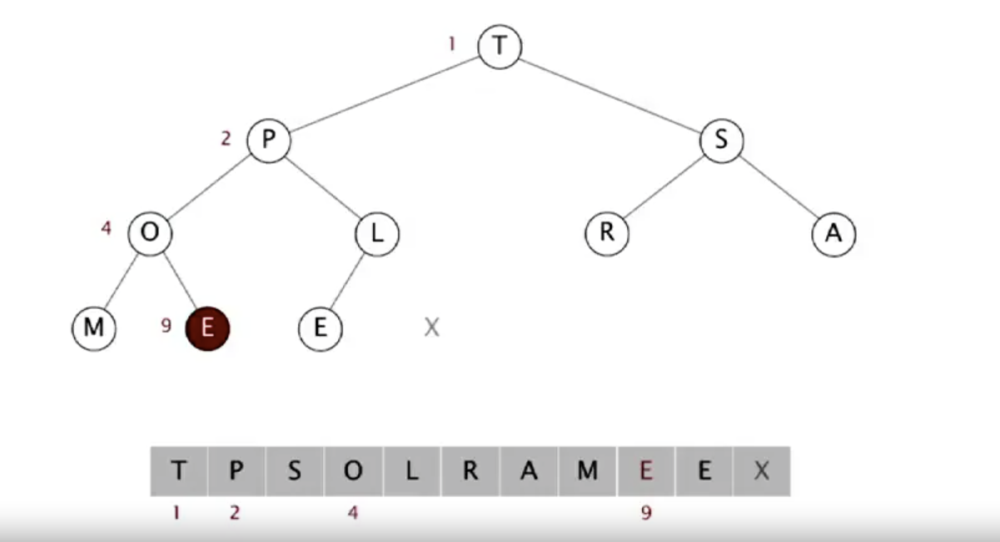
</p>

Repeat the above two steps, exchanging the max value with the node at the end. This time, we fix the max value on the left of the previous fixed node.

<p align="center">
    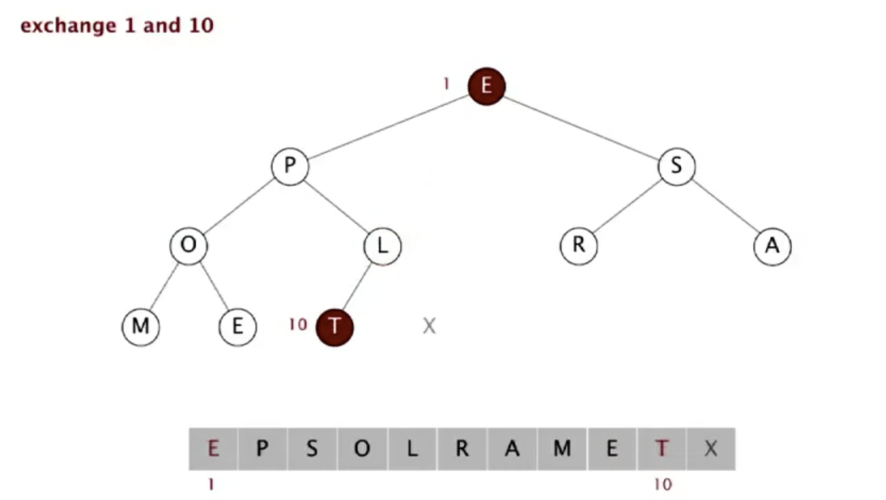
</p>

Finish the loop when all the nodes have been fixed.

<p align="center">
    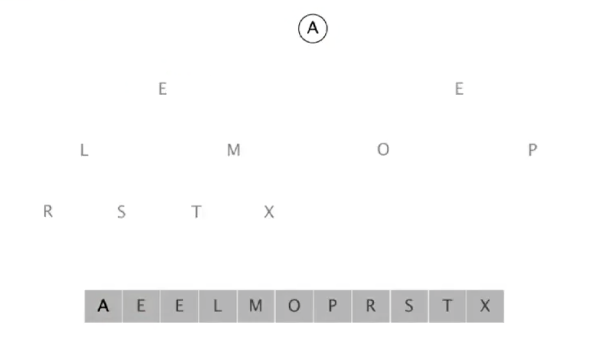
</p>

Check out [HeapSort.java].

## References

-   [Algorithms, Part 1]

[algorithms, part 1]: https://www.coursera.org/learn/algorithms-part1/home/welcome
[programming assignment: percolation]: https://coursera.cs.princeton.edu/algs4/assignments/percolation/specification.php
[stacks]: ./main/src/main/java/com/catherine/stacks/
[queues]: ./main/src/main/java/com/catherine/queues/
[mergesort.java]: /main/src/main/java/com/catherine/sorting/MergeSort.java
[mergesortbottomup.java]: /main/src/main/java/com/catherine/sorting/MergeSortBottomUp.java
[quicksort.java]: /main/src/main/java/com/catherine/sorting/QuickSort.java
[selection.java]: /main/src/main/java/com/catherine/sorting/impl/Selection.java
[duplicatekeys.java]: /main/src/main/java/com/catherine/sorting/impl/DuplicateKeys.java
[binaryheap.java]: /main/src/main/java/com/catherine/pq/BinaryHeap.java
[heapsort.java]: /main/src/main/java/com/catherine/pq/HeapSort.java
[1]: https://en.wikipedia.org/wiki/Heapsort
